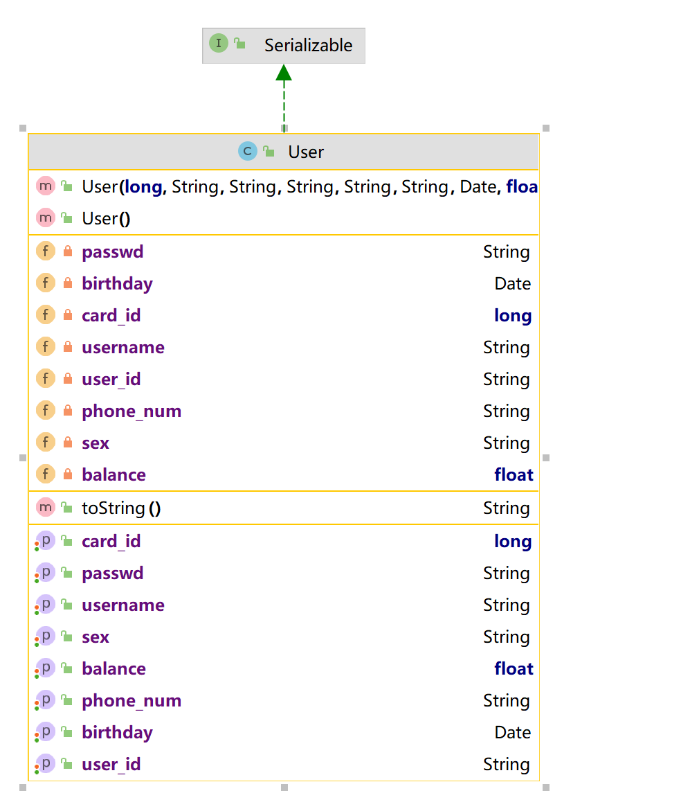

# 项目开发文档

## 项目配置：

- 用户操作界面选择使用Terminal
- 数据方面使用数据库MySQL8.0
- Java版本为JDK1.8
- 使用了线程池和数据库的连接池

## 项目架构：

考虑到功能的改建和删减，降低模块间的耦合度，我们选择了采用MVC结合三层架构设计服务端，将程序分为：

- **视图层View**

  为用户提供使用界面，与用户直接进行交互。接收用户的输入，调用Service层响应用户。

- **服务层Service**

  调用Dao层，实现业务逻辑，比如转账操作。

- **持久层Dao**

  使用JDBC实现对数据库表最基础的增删改查操作。

客户端部分由于代码量较少，所以使用单个文件简单实现。

## 项目目录(粗体为directory)

- **entity**
  - User.java：完全与User表对应的类，一个User实例相当于User表中的一条记录
- **dao**
  - BaseDAO.java：封装JDBC，实现通用表的增删改查
  - **interfaces**：
    - IUserDAO：调用BaseDAO，通过sql语句实现对User表的增删改查，方法的参数和返回值均为User，数据库连接从外部传入
  - **impl**
    - UserDAOImpl.java
- **service**
  - **interfaces**
    - IUserService.java：调用IuserDAO，实现具体的逻辑，如转账功能，在一个连接中完成，如果失败则数据回滚。方法的参数为具体的数据类型，即封装了IUserDAO、User，对view的调用者来说不可见
  - **impl**
    - UserServiceImpl.java
- **view**
  - Server.java：创建线程池，作为守护进程，监听接口，收到连接请求从线程池中选择一个空闲线程响应
  - Channel.java：线程程序
- **util**
  - CommonUtils.java：定义close()方法，关闭继承了Closeable的资源，包括socket，IO流
  - JDBCUtils.java：初始化时实现数据库连接池，提供getConnection()静态方法从连接池中获取连接
  - ServerUtils.java：用于Server接收数据时的有效性验证
- **property**
  - druid.properties
  - socket.properties

### 1. 数据库设计：

> 因为mysql不区分大小写，所以使用的是下划线命名法

**User表：**

| 属性名                     | 类型           | 约束                        |
| -------------------------- | -------------- | --------------------------- |
| card_id                    | bigint         | primary_key, auto_increment |
| username（name是关键字）   | varchar(30)    | not null                    |
| passwd（password是关键字） | varchar(30)    | not null, lentgh > 4        |
| user_id                    | char(12)       | unique, not null            |
| phone_num                  | char(11)       |                             |
| sex                        | enum('M', 'F') |                             |
| birthday                   | date           |                             |
| balance                    | double(10, 2)  | not null                    |
| create_date（考虑          |                |                             |

### 2. 针对数据库中的表设计entity

**User：**



## 功能设计

- 用户功能
  - 开户
  - 登录
    - 账户信息查询
    - 存钱
    - 取钱
    - 转账
    - 销户
- 管理功能
  - 管理账号登录
    - 批量插入
    - 批量导出
    - pdf年度报告

## C/S的通信规则设计

制定双方的通信流程才能使双方实现预期的数据传输功能：

双方都要进行数据的有效性检验，client在输入时检验，server在运行前检验

- client

  1. 提交操作名

  2. 提交操作参数

  3. 获取运行状况

     - success，接收服务器传来的结果

     - failure，输出服务器传来的报错信息

       ```java
        if (dis.readBoolean()) {
       	System.out.println("XXXX操作成功！");
       	// ...  接收操作的返回值
       } else {
       System.out.println(dis.readUTF()); // 接收错误信息
        }
       ```

- server

  1. 接收操作名

  2. 接收操作参数，

  3. 根据操作名以及参数执行具体操作

  4. 验证参数有效性

     - 如果数据无效，直接

  5. 执行操作

  6. 运行结果

     - 成功，并根据具体操作返回结果

       ```java
       private void sendTrue() throws IOException {
           dos.writeBoolean(true);
           dos.flush();
       }
       ```

     - 失败，提供错误信息

       ```java
       private void sendFalse(String msg) throws IOException {
       	dos.writeBoolean(false);
           dos.writeUTF(msg);
           dos.flush();
       }
       ```

## 命名规范：

- 类名使用大驼峰命名法(**UpperCamelCase**) 风格。
  方法名、参数名、成员变量、局部变量需要使用小驼峰命名法(**lowerCamelCase**)

- 测试方法名、常量、枚举名称使用下划线命名法(**snake_case**)

  并且，测试方法名称要求全部小写，常量以及枚举名称需要全部大写。

- 项目文件夹名称使用串式命名法(**kebab-case**)

- 包名统一使用小写，尽量使用单个单词作为包名，各个单词通过"."分隔符连接，并且各个单词必须为单数。

- 抽象类命名使用**Abstract**开头

- 异常类命名使用**Exception结尾**。

- 测试类命名用测试使用的类的类名+Test

